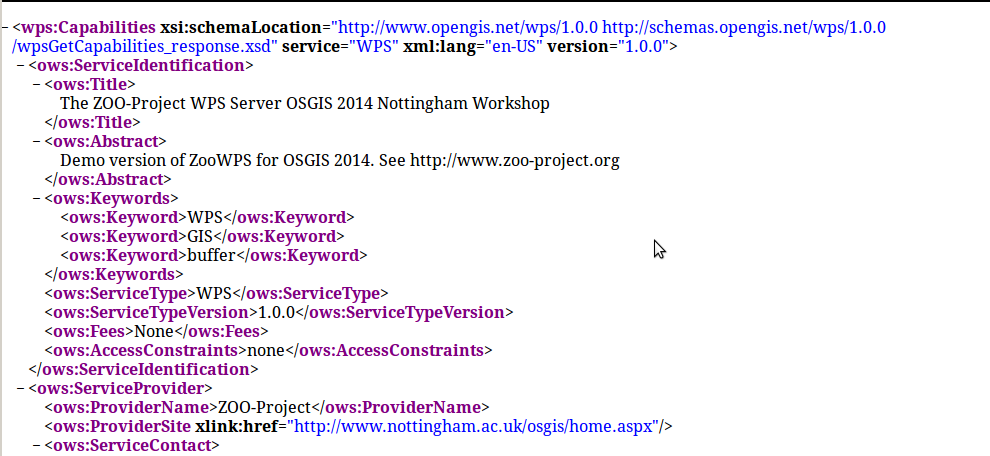

# Customising Your Server

The basic information about your new ZOO WPS Service is stored in the file main.cfg, which lives in the same file as the ZOO kernel or cgi file. In this case, it's in /usr/lib/cgi-bin. Navigate to this location by double-clicking on the "file system" icon on the desktop to open the file manager. Find "main.cfg" and double-click it to open in a text editor.

Before you can make changes to this file you will need to make it editable. In your terminal, type the following:

    cd /usr/lib/cgi-bin
    sudo chmod 777 main.cfg

Remember to give the sudo password if prompted.
Note that this is not good practice as it opens up the config file to being edited by anyone but for the purposes of this demonstration it's OK.

The main.cfg file contains some configuration information and metadata about the server as a whole, not the services that run on it. Typically it will look something similar to this:

    [main]
    lang=en-US
    version=1.0.0
    encoding=utf-8
    serverAddress=http://localhost/cgi-bin/zoo_loader.cgi
    dataPath=/var/www/temp/
    tmpPath=/var/www/temp/
    tmpUrl=../temp
    cacheDir=/var/www/temp/
    mapserverAddress=http://localhost/cgi-bin/mapserv
    msOgcVersion=1.0.0

    [identification]
    title=The ZOO-Project WPS Server OSGIS 2014 Workshop
    keywords=WPS,GIS,buffer
    abstract=ZOO-Project platform 2014 .See http://www.zoo-project.org for more information
    accessConstraints=none
    keywords = WPS, Buffer, Routing
    fees=None

    [provider]
    positionName=Developer
    providerName=False
    addressAdministrativeArea=False
    addressDeliveryPoint=Business School South, Jubilee Campus
    addressCountry=uk
    phoneVoice=False
    addressPostalCode=False
    role=Dev
    providerSite=http://www.nottingham.ac.uk/osgis/home.aspx
    phoneFacsimile=False
    addressElectronicMailAddress=False
    addressCity=Nottingham
    individualName=False

    [headers]
    X-Powered-By=ZOO-Project@OSGIS

The various sections of this document contain key-value pairs of parameters. This is not an exhaustive list of the options, these can be found in the [ZOO documentation](http://www.zoo-project.org/docs/workshop/2013/using_zoo_from_osgeolivevm.html#testing-the-zoo-installation-with-getcapabilities)

## main

Contains information about the location of folders and executables for ZOO. You should not need to change this once it is set up.

## identification

Contains information to identify the server. You can change the values in here, but not the keys.

## provider

This section lists the contact information for the server. Feel free to edit the values in this section, but not the keys. You will see that sections cannot be left blank, if they are present they must contain a value, but you can set this to 'False' if you don't want to provide a fax number, for example.

# Testing the Server

Once you have completed main.cfg to your satisfaction and you have mde sure you have saved your changes, it's time to make our first request to the server!

Move your mouse to the bottom of the window and find the web browser icon (second from the left). Click on this to open firefox.

In the URL window type the following:

     http://localhost/cgi-bin/zoo_loader.cgi?Request=GetCapabilities&Service=WPS

If you have typed this correctly and have no mistakes in your main.cfg file you should see an xml document containing the GetCapabilities response from the server:

If you scroll down through this response you will see a number of processes available, which are pre-defined as part of the ZOO demo that you downloaded.