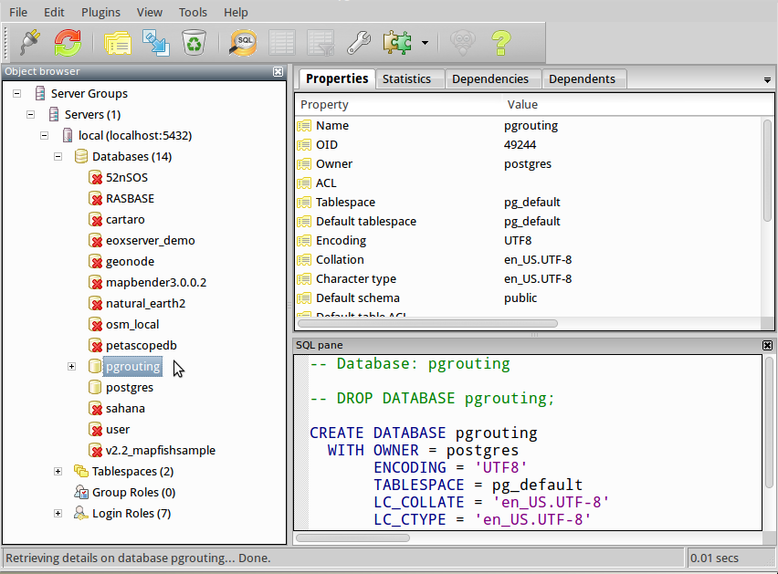
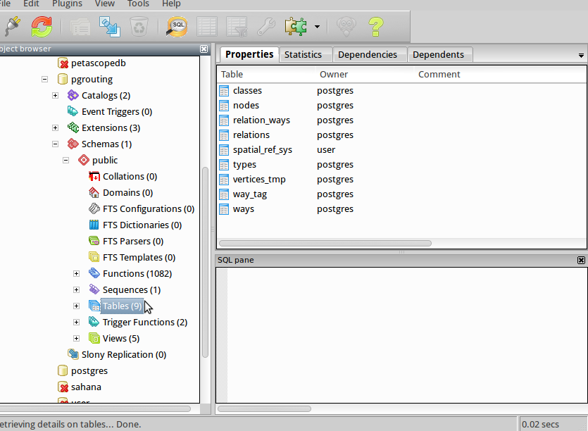
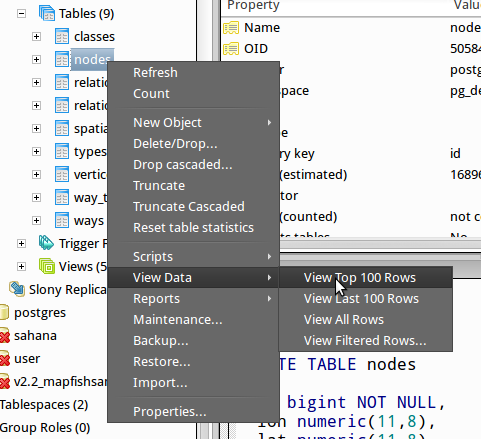
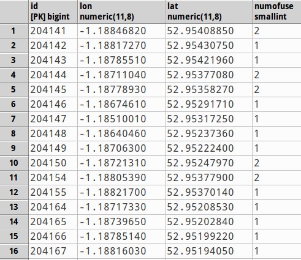
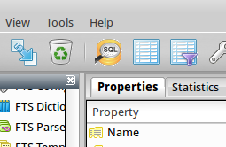

# Exploring our routing data in PgAdmin3

Before trying to work with our routing data in a GIS or web-based map, it's important to understand the structure of the data and what the results of a Shortest Path or Driving Distance calculation actually look like.

On your OSGeo LiveDVD desktop, double-click on the Databases folder, and then double-click on the PgAdmin3 icon to open it. PgAdmin3 is a graphical user interface for PostgreSQL.

Expand "Server Groups\Servers\local (localhost:5432)" and then find "pgrouting" in the list of databases. 

This is pre-loaded with some routing data and a network, based on the OpenStreetMap data for the Nottingham area. Expand "Schemas\public\Tables" to see the list of tables in the database (hint, there should be 1 schema, and 9 tables).

Note that the sample data was loaded using osm2pgrouting, and some of the columns that we would normally expect to be filled in have been left blank, such as the cost. 

The tables "nodes" and "ways" are the pgRouting tables. If you expand "nodes/columns" you'll see the following:

 * **id**: a numeric ID for this node;
 * **lon**: the "Easting" coordinate for this node;
 * **lat**: the "Northing" coordinate for this node;
 * **numofuse**: the number of ways that connect to this node.

Right-click the "nodes" table name, and choose "View Data/View Top 100 Rows" to get a sample of what this looks like. 

You can ignore the warning about editing data without a primary key, as we're only going to be looking, so click "OK" to dismiss this.

If you expand "ways/columns", you'll see the following:

 * **gid**: a numeric id for this node;
 * **class_id**: a link to the classes table, which contains information on the different classifications of road;
 * **length**: the length of this way or edge;
 * **name**: the name of this way or edge;
 * **x1**: the x coordinate of the start node for this way;
 * **y1**: the y coordinate of the start node for this way;
 * **x2**: the x coordinate for the end node for this way;
 * **y2**: the y coordinate for the end node for this way;
 * **reverse\_cost**: the cost for travelling along this way in the reverse direction (left blank in the sample data);
 * **rule**: left blank in the sample data;
 * **to\_cost**: the cost for travelling along this way in the forward direction (left blank in the sample data);
 * **maxspeed_forward**: the max speed travelling along this way in the forward direction;
 * **maxspeed_backward**: the max speed travelling along this way in the reverse direction;
 * **osm\_id**: the original openstreetmap ID for this way
 * **priority**:  left blank in the sample data
 * **the_geom**: the geometry for this line in well-known binary format;
 * **source**: the id for the source node for this way;
 * **target**: the id for the target node for this way.
 
Right-click the "ways" table name, and choose "View Data/View Top 100 Rows" to get a sample of what this looks like. Again, click "OK" to dismiss the warning about editing data without a primary key. In particular, notice how rows with identical osm_ids, in other words edges that originally form part of the same road, have source and target nodes that link together.

Having explored the structure of the data, we can now run a shortest path query directly in pgadmin3 using the SQL window. Close any open tables but leave PgAdmin3 open. Click on the SQL button in the toolbar:

 

This opens a SQL Editor window where we can write queries. Copy the following into the SQL editor window:

    select pgr_dijkstra('select gid as id, source, target, length/maxspeed_forward as cost, length/maxspeed_backward as reverse_cost from ways', 1, 9, true, true);

If we recall from the introduction to pgRouting functions, pgr_dijkstra requires 5 parameters. 

 * The first is a SQL select statement that returns the id, source, target, cost and reverse_cost columns. In our ways table, the id column is called gid, so we must alias that using 'gid as id';
 * Our cost columns are blank, so we can substitute in a length/maxspeed_forward calculation for the forward cost and length/maxspeed_backward as the reverse_cost;
 * The query above arbitrarily chooses nodes 1 and 9 as the start and end nodes for the calculation, feel free to choose different ones;
 * Since we have chosen to take the direction of travel into account, we have set "directed" = true and "has_rcost" = true;

Click the green "execute query" button to run the query:

Depending on the source and targets nodes that you selected, this query should return a set of rows, describing each step on the journey. The final row will always have an edge id (id2) of -1.

We can make this query easier to understand and work with, by remembering that pgr_costresult[] is an array of the form (seq, id1, id2, cost). Therefore we can use these attributes in our query:

    select seq as id, id1 as node, id2 as edge, cost from pgr_dijkstra('select gid as id, source, target, length/maxspeed_forward as cost, length/maxspeed_backward as reverse_cost from ways', 1, 9, true, true);

### Displaying the results on a map

Finally, to display this data on a map we would need to apply some geometries to the results. Each row returned in the query equates to an edge, therefore we can use the original "ways" geometry, matching the edge id from "ways" to the edge id returned in our query above:

    select seq as id, id1 as node, id2 as edge, cost, the_geom from pgr_dijkstra('select gid as id, source, target, length/maxspeed_forward as cost, length/maxspeed_backward as reverse_cost from ways', 1, 9, true, true) as route join ways on ways.gid = route.id2;

We're going to use this query in QGIS to help visualise the results.
