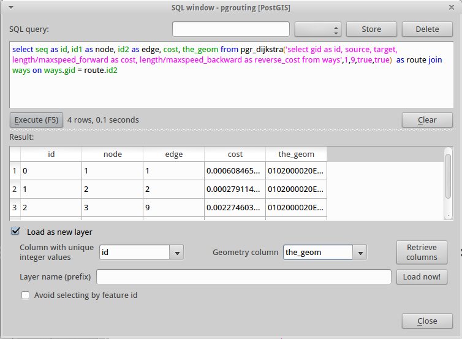
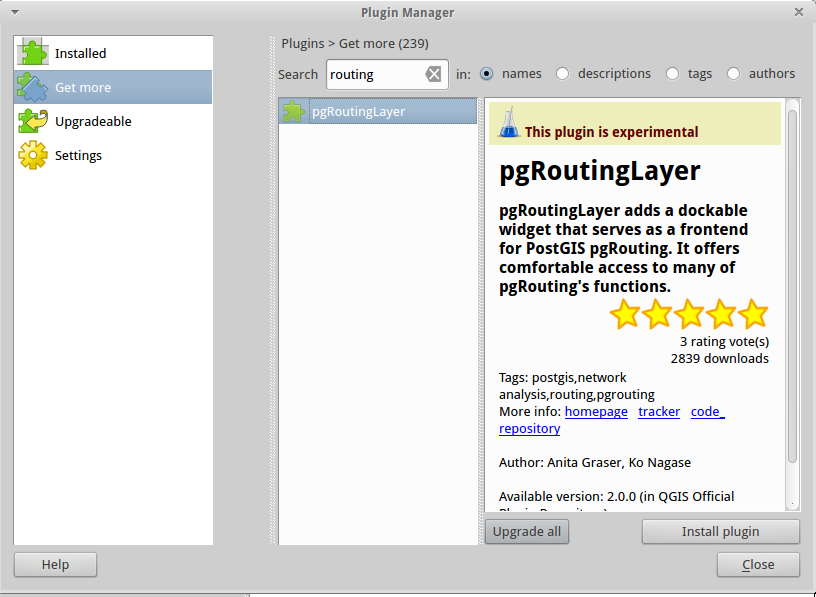
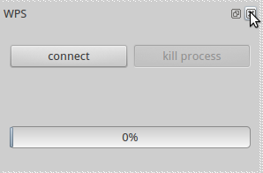

# Testing our routing function in QGIS

## Using the database manager plugin

QGIS provides a handy database manager plugin that will allow us to load the results of our shortest path query as a layer.

Without closing PgAdmin3 (you're going to need to copy the SQL for that query), go to "Applications/Education/QGIS" if it's not already open. Find the database manager button on the tool bar:

Open "DB Manager/DB Manager" and expand "postgis/pgrouting" in the left-hand list. Click the "SQL window" button:

Then copy the SQL query from PgAdmin3 into the SQL Window. Click the "Execute (F5)" button to see the results.

Tick "load as new layer" to bring up the layer dialogue:

Make sure that you select the id column as the "Column with unique integer values" and the_geom as "Geometry Column". Add a layer name if you wish, otherwise click the "load now!" button to load your query results on the map.

Note that with no base mapping or context, this will look very dull!

## Using the pgRoutingLayer plugin

This is a front-end to pgRouting that avoids the need to write out complex SQL queries.

To install it, go to "Plugins/Manage and Install Plugins" from the top menu:

Click on "Get More" in the left had list and type "routing" in the Search box to bring up the pgRoutingLayer plugin:

If you can't see it, this might be because QGIS is not set to load experimental plugins. Click on "Settings" in the left hand list and ensure that the box marked "Show also experimental plugins" is ticked, then retry the above search.

When you can see the pgRoutingLayer plugin, click the "Install plugin" button and then "OK" and "Close" to dismiss the plugin manager dialogue.

You should now see a pgRouting Layer widget below the WPS widget in QGIS. If things are looking a little crowded, click the "x" button for the WPS widget to close it (we can restore it later):

To use this plugin, you set the various parameters for the function using the dropdown boxes. The slight limitation is that it won't accept calculations for the cost and reverse_cost boxes, so we'd need to update these using the dynamic length\maxspeed_forward calculation that we used in our SQL statement rather than using it on-the-fly.

